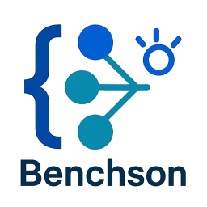

# Benchson
The GenAI JSON generation benchmark

## Description

JSON generation is one of the main jobs of an LLM — models emit JSON to return results, call APIs and tools, and produce structured data. Benchson measures how well a model does this across realistic, content-grounded tasks.

Benchson covers three task families, which we think are the most popular and realistic tasks that models face:

- **create-by-description** — given a json schema and a description of an object, produce the matching JSON.
- **fix-invalid** — given a schema-violating object, repair it.
- **modify-by-instruction** — given an object, a json schema and a free-text change (e.g. *"remove the first two items from the cart"*), return the modified JSON.

Each output is scored on three independent axes: **json_validity** (parseable), **schema_compliance** (passes `jsonschema`), and **semantic_fidelity** (field values match the ground truth).

Benchson is two things in one:

1. **An evaluation framework** (`src/main.py`) — config-driven, provider-agnostic, runs evaluations over datasets and writes a scored CSV.
2. **A benchmark + training-data generator** — builds the ground-truth datasets above (test *and* train, from disjoint schema pools to avoid contamination) and exports a fine-tuning set.

The benchmark, its tasks, metrics, and build pipeline are documented in **[BENCHMARK.md](BENCHMARK.md)**.

## The dataset (on Hugging Face)

This repository holds the **generators and evaluations** — the generated benchmark
data is **not** committed here (it would bloat the repo and is regenerable). The
frozen, versioned dataset lives on the Hugging Face Hub:

**👉 [`aviv1ron1/Benchson`](https://huggingface.co/datasets/aviv1ron1/Benchson)**

```python
from datasets import load_dataset
# configs: create / fix / modify; splits: train / test
ds = load_dataset("aviv1ron1/Benchson", "create", split="test")
# pin a frozen release for reproducible scores:
ds = load_dataset("aviv1ron1/Benchson", "create", revision="v2")
```

To (re)generate the data yourself from the schema corpus, see
[Building the benchmark and training data](#building-the-benchmark-and-training-data)
below.


# Running Benchson

## Setup environment and install dependencies

Benchson requires Python `>=3.13` and uses [uv](https://docs.astral.sh/uv/) for dependency management.

Install core dependencies:

```bash
uv sync
```

### Provider dependencies

Heavy providers (local models, cloud SDKs) are declared as optional dependency groups and must be installed explicitly before use. Lightweight providers (OpenAI, Claude, Google) install themselves automatically on first run.

| Provider | Group | Command |
|---|---|---|
| HuggingFace Transformers | `hf` | `uv sync --group hf` |
| vLLM (Linux/GPU only) | `vllm` | `uv sync --group vllm` |
| IBM WatsonX | `watsonx` | `uv sync --group watsonx` |

You can combine groups:

```bash
uv sync --group hf --group watsonx
```

The evaluation framework is executed via the `main.py` script. You can run it with the following command:

```bash
uv run python src/main.py --config configs/example.json
```

### Command-Line Arguments

- `--config <path>`: Specifies the path to the JSON configuration file.
- `--output <path>`: Specifies the path to the output CSV file.

## Building the benchmark and training data

Besides running evaluations, Benchson can **generate** the ground-truth datasets it
scores against. Each stage is a config-driven CLI (see **[BENCHMARK.md](BENCHMARK.md)**
for full details):

```bash
# 1. Import real-world schemas from JSONSchemaBench (no API key needed)
uv run python src/import_jsonschemabench.py --config configs/import_jsonschemabench.json

# 2. Build the ground-truth benchmark (test + train, from disjoint schema pools)
#    using a strong "builder" model, optionally verified by a separate validator model
uv run python src/build_benchmark.py --config configs/build_benchmark.json

# 3. Run the benchmark on a target model (scores the held-out test split)
uv run python src/main.py --config configs/run_benchmark.json

# 4. Export the train split to chat JSONL for fine-tuning
uv run python src/export_training.py --config configs/export_training.json
```

The builder mints a valid object per schema, then derives the create / fix / modify
instances from it, applying quality gates (and an optional round-trip check by a
second model) so the ground truth is correct by construction. The held-out `test/`
split is scored; the `train/` split is exported for SFT — never the other way around.

> There is also an older, simpler training-data generator (`src/generate_data.py`)
> that emits chat/alpaca examples directly from schemas; the benchmark builder above
> supersedes it for the grounded tasks.

### Running via lm-evaluation-harness

Besides the built-in runner (step 3), the benchmark can be scored with
[EleutherAI's lm-evaluation-harness](https://github.com/EleutherAI/lm-evaluation-harness).
Ready-made task definitions live in [`lm_eval_tasks/`](lm_eval_tasks/) (`benchson_create`,
`benchson_fix`, `benchson_modify`, and the `benchson` group):

```bash
pip install lm-eval
lm_eval --model hf --model_args pretrained=<your-model> \
  --tasks benchson --include_path lm_eval_tasks --apply_chat_template
```

These tasks reuse the same prompts and metrics as the native runner (prompt parity is
verified) and can load either the local `data/benchmark_*/test/` files or the published
HF dataset — see [`lm_eval_tasks/README.md`](lm_eval_tasks/README.md).

## Configuration

The framework uses a JSON configuration file to determine:

- **Which evaluations to run**
- **Which datasets to use for each evaluation**
- **Which LLM provider and model to use** (e.g., WatsonX, OpenAI, Claude, Google Vertex, etc.)
- **Which observability provider to use** (e.g., Langfuse)
- **Where to output results**

An example configuration is found in `configs/example.json`.

Any other configurations you place in the configs folder will be ignored from git so you dont share your secret keys by mistake.

### Example Configuration (`configs/example.json`)

All the concepts of this configuration such as `Datasets`, `LLM Provider` etc will be explained later in this documentation.

```json
{
    "output_file": "results.csv",
    "evaluations": [
        {
            "name": "Create valid JSON according to a given schema",
            "module": "src.evaluations.create_by_schema.create_by_schema",
            "class": "CreateBySchema",
            "datasets": ["schemas"]
        }
    ],
    "llm_provider": {
        "module": "src.llm.openai.openai_provider",
        "class": "OpenAIProvider",
        "params": {
            "api_key": "your-api-key",
            "model": "gpt-4"
        }
    },
    "observability_provider": {
        "module": "src.observability.langfuse.langfuse_observability",
        "class": "LangfuseObservability",
        "params": {
            "secret_key": "your-langfuse-secret-key",
            "public_key": "your-langfuse-public-key",
            "host": "your-langfuse-host-url"
        }
    }
}
```

### Configuration Fields

- `output_file`: Base filename for results (default: `results.csv`). The actual filename is suffixed with the total score and instance count, e.g. `results-17-20.csv`.
- `evaluations`: List of evaluations to run.
  - `name`: A user-friendly name for the evaluation.
  - `module`: The module (folder path) where the evaluation class is implemented.
  - `class`: The class name of the evaluation.
  - `datasets`: List of dataset paths to use for the evaluation.
- `llm_provider`: Defines the LLM provider to use (shared across all evaluations).
  - `module`: The module where the LLM provider class is implemented.
  - `class`: The class name of the LLM provider.
  - `params`: Any necessary parameters (e.g., API keys, model names, etc.).
- `observability_provider`: *(optional)* Defines the observability provider (shared across all evaluations).
  - `module`: The module where the observability provider class is implemented.
  - `class`: The class name of the observability provider.
  - `params`: Any necessary parameters.

### Running With a Custom Configuration

You can create a new configuration file and run it:

```bash
uv run python src/main.py --config configs/custom_config.json
```

This allows you to test different evaluations, LLM providers, and datasets without modifying the code.


## Datasets

> **Note:** the generated benchmark datasets (`data/benchmark_*`) and the imported
> schemas (`data/jsb_schemas`) are **git-ignored** — they live on the Hugging Face
> Hub at [`aviv1ron1/Benchson`](https://huggingface.co/datasets/aviv1ron1/Benchson),
> not in this repo. Recreate them locally with the import + build CLIs (see
> [Building the benchmark](#building-the-benchmark-and-training-data)).

The framework expects datasets to be placed inside the `data/` folder, but you can also load datasets from absolute path if you provide one. 

Each dataset should have the following structure:

```
data/
  dataset_name/
    train/
      instance1.json
      instance2.json
      ...
    test/
      instance1.json
      instance2.json
      ...
```

### **Train & Test Folders**
- **`train/`**: Contains instances used for training or reference. This is optional — only `test/` is scored.
- **`test/`**: Contains instances used for evaluation. These are the instances that Benchson will use to evaluate.

For benchmark datasets built by `build_benchmark.py`, `train/` and `test/` are drawn
from **disjoint schema pools**, so a model fine-tuned on `train/` is never evaluated
on a schema it saw during training. This schema-level split is the contamination
guard; see **[BENCHMARK.md](BENCHMARK.md)**.

### **Dataset Instances**
Each dataset instance is stored as a file (e.g., `instance1.json`). The format of each file depends on the evaluation type but generally follows this structure:

```json
{
    "data": { ... },
    "ground_truth": { ... }
}
```
- **`data`**: The input data for the LLM.
- **`ground_truth`** *(optional)*: The expected result for evaluation. Not All evaluations have a ground truth. For example some may only test the the generated JSON is valid as the metric.

### **Dataset Configuration in JSON**
In the configuration file, datasets are referenced by their folder name:

```json
"datasets": ["data/schemas"]
```
This tells the framework to load training and test instances from `data/schemas/`.

---

## Evaluation

The framework supports different types of evaluations to assess LLM performance on specific tasks. Each evaluation is dynamically loaded based on the configuration file.

### **Evaluation Structure**
Evaluations are implemented as Python classes and are located in the `src/evaluations/` directory. Each evaluation inherits from the base `Evaluation` class and customizes its behavior.

### **How Evaluations Work**
1. The evaluation iterates through the test dataset instances.
2. It formats each test instance into an LLM prompt.
3. The LLM generates a response.
4. The evaluation compares the response against the ground truth or some other metric.
5. The result is stored as an `EvaluationResult` with a primary **score (0 or 1)**, an optional **explanation**, and an optional **`metrics`** dictionary of additional named scores.

The primary score is the `Score` column in the results CSV. Any extra `metrics`
(e.g. `json_validity`, `semantic_fidelity`) become additional columns, so a single
run reports multiple axes per instance.

### **Example Evaluation: CreateBySchema**
The `CreateBySchemaEvaluation` evaluates how well an LLM generates JSON that conforms to a schema.

#### **How It Works**
- The test dataset contains JSON schemas, optionally enriched with a `description`/`source_doc` (the object to produce) and a `reference_json` ground truth.
- The LLM is prompted to generate JSON matching the schema (and the description, when present).
- `schema_compliance` (the primary score) is **1** if the output is valid against the schema, else **0**.
- It additionally reports `json_validity` and, when a `reference_json` is present, `semantic_fidelity` (the fraction of ground-truth field values recovered).

#### **Example Test Case**
```json
{
    "data": {
        "type": "object",
        "properties": {
            "name": { "type": "string" },
            "age": { "type": "integer" }
        },
        "required": ["name", "age"]
    }
}
```

#### **Example LLM Response**
```json
{
    "name": "Alice",
    "age": 30
}
```

#### **Evaluation Result**
If the generated JSON is valid:
```json
{
    "score": 1,
    "explanation": "Generated JSON is valid against the schema.",
    "ground_truth": null
}
```

If the JSON is invalid:
```json
{
    "score": 0,
    "explanation": "Missing required field 'age'.",
    "ground_truth": null
}
```

### **Evaluation: ModifyJson**
The `ModifyJson` evaluation tests the LLM's ability to modify a JSON object according to a natural-language instruction.

- Dataset instances contain `data` (the original JSON), `instructions` (what to change), `ground_truth` (the expected result), and optionally a `schema`.
- Reports `json_validity`, `schema_compliance` (the primary score, when a schema is present — otherwise exact match to ground truth), and `semantic_fidelity` against the ground truth.

```json
"evaluations": [
    {
        "name": "Modify JSON",
        "module": "src.evaluations.modify_json_evaluation.modify_json_evaluation",
        "class": "ModifyJson",
        "datasets": ["modifications"]
    }
]
```

### **Evaluation: ErrorJson**
The `ErrorJson` evaluation tests the LLM's ability to fix a broken JSON object so that it conforms to a given schema.

- Dataset instances contain `erroneous_json`, `schema`, and `valid_json` (ground truth), and optionally a `description` to help recover removed values.
- Reports `json_validity`, `schema_compliance` (the primary score), and `semantic_fidelity` against the ground truth.

```json
"evaluations": [
    {
        "name": "Fix JSON errors",
        "module": "src.evaluations.json_error_evaluation.json_error_evaluation",
        "class": "ErrorJson",
        "datasets": ["errors"]
    }
]
```

### **Evaluation: SchemaFromInstances**
The `SchemaFromInstances` evaluation tests the LLM's ability to generate a JSON Schema Draft-07 that describes a set of provided JSON instances.

- Dataset instances must contain an `instances` array of JSON objects.
- Score is **1** if the generated schema is valid Draft-07 and all provided instances validate against it, otherwise **0**.

```json
"evaluations": [
    {
        "name": "Generate schema from instances",
        "module": "src.evaluations.schema_from_instances.schema_from_instances",
        "class": "SchemaFromInstances",
        "datasets": ["schemas"]
    }
]
```

### **Configuring Evaluations**
Evaluations are defined in the configuration file:

```json
"evaluations": [
    {
        "name": "Schema Validation Test",
        "module": "src.evaluations.create_by_schema.create_by_schema",
        "class": "CreateBySchema",
        "datasets": ["schemas"]
    }
]
```

- **`name`**: A user-friendly name of the evaluation.
- **`module`**: The Python module where the evaluation class is implemented.
- **`class`**: The evaluation class name.
- **`datasets`**: The datasets to use for evaluation.

---

## Implementing a New Evaluation

Please refer to `src/evaluations/create_by_schema` as a reference to how Evaluations should be built.

To create a new evaluation, follow these steps:

### **1️⃣ Create a New Evaluation Class**
All evaluations must inherit from the base `Evaluation` class and implement custom logic.

Create a new folder inside `src/evaluations/`, for example:
```
src/evaluations/fix_errors_evaluation/fix_errors_evaluation.py
```

within this folder you should have:
1. A python file containing a class extending `Evaluation`
2. An empty `__init__.py` file
3. A `.md` readme file that explains about your evaluation so people can use it

The two methods you MUST implement are `format_for_llm` and `metric_function`.

You may also customize `prepare_test_case` which deals with how you load the data from the datasets.

Example implementation:
```python
from src.evaluations.evaluation import Evaluation
from src.evaluation_result import EvaluationResult
import json
import re

class FixErrorsEvaluation(Evaluation):
    """An example evaluation that measures the ability to fix a broken JSON into a valid one."""
    
    def format_for_llm(self, test_case):
        return f"Following is a broken JSON, find the problem in the JSON and fix it so that it is valid: ```json {test_case['data']}```"
    

def metric_function(self, test_case, llm_result):
    """Checks if the generated result is valid JSON."""
    # Remove markdown-style JSON formatting if present
    cleaned_json = re.sub(r"```json\s*|\s*```", "", llm_result).strip()
    try:
        json.loads(cleaned_json)
        return EvaluationResult(score=1, explanation="Valid JSON format.")
    except json.JSONDecodeError as e:
        return EvaluationResult(score=0, explanation=f"Invalid JSON: {e}")
```

---

## Provider

The `LLMProvider` and `ObservabilityProvider` both extend `Provider`.

Heavy providers (local models, cloud SDKs) declare their dependencies as uv groups in `pyproject.toml` and must be installed before use — see [Provider dependencies](#provider-dependencies) above.

Lightweight providers (OpenAI, Claude, Google, etc.) use runtime lazy installation via `install_dependency()`, so no pre-install step is needed:

```python
class MyProvider(Provider):
    def __init__(self):
        self.install_dependency("my_provider_library")
        from my_provider_library import MyProviderClass
```

The first line installs the library if absent. The second imports it.

## LLM Provider

The `LLMProvider` class serves as an abstraction layer for interacting with various LLM APIs. Each specific provider (e.g., OpenAI, Claude, Google Vertex, etc.) extends this class to implement provider-specific behavior.

### **1️⃣ How to Use an LLM Provider**
The evaluation framework dynamically loads an LLM provider based on the configuration file. The configuration specifies the module, class, and parameters needed to initialize the provider. Each provider is placed in a folder together with a readme file with details on which parameters are required and allowed.

#### **Example Configuration for OpenAI**
```json
"llm_provider": {
    "module": "src.llm.openai.openai_provider",
    "class": "OpenAIProvider",
    "params": {
        "api_key": "your-api-key",
        "model": "gpt-4"
    }
}
```

- The framework loads the module (`src.llm.openai.openai_provider`).
- It instantiates the class (`OpenAIProvider`).
- The parameters (`api_key`, `model`) are passed to the class.

Once loaded, the evaluation framework calls `generate()` on the provider to interact with the LLM.

---

### **2️⃣ Implementing a New LLM Provider**
To add a new LLM provider, follow these steps:

### **Step 1: Create a New Provider Class**
Each provider must extend `LLMProvider` and implement `_generate()`, which calls the actual LLM API.

Create a new directory for your provider inside `src/llm/`, for example:
```
src/llm/myprovider/
    ├── __init__.py
    ├── myprovider_provider.py
    ├── readme.md
```

In your readme show an example of the configuration of your provider and document which fields are required and which are optional.

The extending class can declare parameters needed for initialization in the constructor, followed by `**kwargs` at the end.
It must call `super().__init__(**kwargs)` in order to initialize the base class appropriately.

If your are using a library dependency for your llm provider make sure to install and load it as documented in the [Provider](#provider) section.

In addition to the constructor you must implement the `_generate` method. 

### **Message Structure in `_generate()`**

The `_generate()` method receives a `messages` argument, which follows a standard structure used across LLM providers.
The `messages` argument is a **list of dictionaries**, where each dictionary represents a message in the conversation.

Example:
```python
messages = [
    {"role": "system", "content": "You are an AI assistant."},
    {"role": "user", "content": "Tell me a joke."}
]
```
Each message contains:
- **`role`**: The speaker's role in the conversation (`system`, `user`, or `assistant`).
- **`content`**: The actual message text.

#### **Roles Explanation**
| Role       | Description |
|------------|-------------|
| `system`   | Sets the behavior or personality of the LLM (optional). |
| `user`     | Represents the user's input/question. |
| `assistant` | Represents previous responses from the LLM (used for context). |

### **parameters Structure in `_generate()`**

The `parameters` argument is an optional dictionary of key value pairs which can be passed to the LLM generate method.
This can be used to customize the call to the LLM if needed.

Example implementation:
```python
import requests
from src.llm.llm_provider import LLMProvider

class MyProvider(LLMProvider):
    """Custom LLM provider implementation."""
    
    def __init__(self, api_key: str, model: str, **kwargs):
        super().__init__(**kwargs)
        self.install_dependency("my_provider_library")
        from my_provider_library import MyProviderClass
        self.api_key = api_key
        self.model = model
        self.llm = MyProviderClass(api_key, model)

    def _generate(
        self, messages: List[Dict[str, str]], parameters: Dict[str, Any] = None
    ):
        response = self.llm.generate(
            auth={"Authorization": f"Bearer {self.api_key}"},
            data={"model": self.model, "messages": messages, "parameters": parameters or {}}
        )
        return response.text
```

---

### **Step 2: Add It to the Configuration**
Once implemented, reference the provider in the config file:
```json
"llm_provider": {
    "module": "src.llm.myprovider.myprovider_provider",
    "class": "MyProvider",
    "params": {
        "api_key": "your-api-key",
        "model": "my-model-name"
    }
}
```

---

## Observability Provider

The **Observability Provider** framework enables logging and tracing of LLM interactions. This allows users to monitor and analyze the evaluation results using third-party observability tools like **Langfuse**.

### **1️⃣ How Observability Works**
Observability providers are dynamically loaded based on the configuration. The framework calls the observability provider before and after each LLM interaction and also after the evaluation.

**Steps:**
1. `log_request` is called **before** sending a request to the LLM.
2. The LLM processes the request and returns a response.
3. `log_response` is called **after** receiving the response to record metadata and results.
4. `log_evaluation` is called **after** the evaluation to log the evaluation results.

---

### **2️⃣ Using an Observability Provider**
Observability providers are configured in the JSON file. Example configuration for **Langfuse**:
```json
"observability_provider": {
    "module": "src.observability.langfuse.langfuse_observability",
    "class": "LangfuseObservability",
    "params": {
        "api_key": "your-langfuse-api-key",
        "environment": "production"
    }
}
```
- **`module`**: Specifies the module path where the provider is implemented.
- **`class`**: The class name of the observability provider.
- **`params`**: Provider-specific parameters (e.g., API keys, environment settings). Each provider has a respective readme file in its folder that documents the parameters required and other instructions on how to use it.

---

### **3️⃣ Implementing a New Observability Provider**
To create a custom observability provider, follow these steps:

#### **Step 1: Create a New Provider Class**
Each provider must extend `ObservabilityProvider` and implement `log_request()`, `log_response()` and `log_evaluation`.

Create a new directory inside `src/observability/`, for example:
```
src/observability/myprovider/
    ├── __init__.py
    ├── myprovider_observability.py
    ├── readme.md
```

The extending class can declare parameters needed for initialization in the constructor, followed by `**kwargs` at the end.
It must call `super().__init__(**kwargs)` in order to initialize the base class appropriately.

If your are using a library dependency for your observability provider make sure to install and load it as documented in the [Provider](#provider) section.

Example implementation:
```python
from src.observability.observability_base import ObservabilityProvider

class MyObservabilityProvider(ObservabilityProvider):
    """Custom observability provider implementation."""
    
    def __init__(self, api_key: str, **kwargs):
        super().__init__(**kwargs)
        self.install_dependency("my_observability_library")
        from my_observability_library import MyObservability
        self.api_key = api_key
        self.my_observability = MyObservability(self.api_key)

    def log_request(self, request: Dict[str, Any]) -> Any:
        trace = my_observability.trace(request=request)
        return trace

    def log_response(self, trace: Any, response: Dict[str, Any]) -> None:
        my_observability.trace(id=trace.trace_id, response=response)

    def log_evaluation(self, trace: Any, evaluation_result: EvaluationResult) -> None:
        if trace:
            trace_id = trace.trace_id
            self.my_observability.trace(
                id=trace_id,
                output=f"score: {evaluation_result.score}",
                metadata={
                    "explanation": evaluation_result.explanation,
                    "ground_truth": evaluation_result.ground_truth,
                },
            )
```

---

#### **Step 2: Add It to the Configuration**
Once implemented, reference the provider in the config file:
```json
"observability_provider": {
    "module": "src.observability.myprovider.myprovider_observability",
    "class": "MyObservabilityProvider",
    "params": {
        "api_key": "your-api-key"
    }
}
```

---
